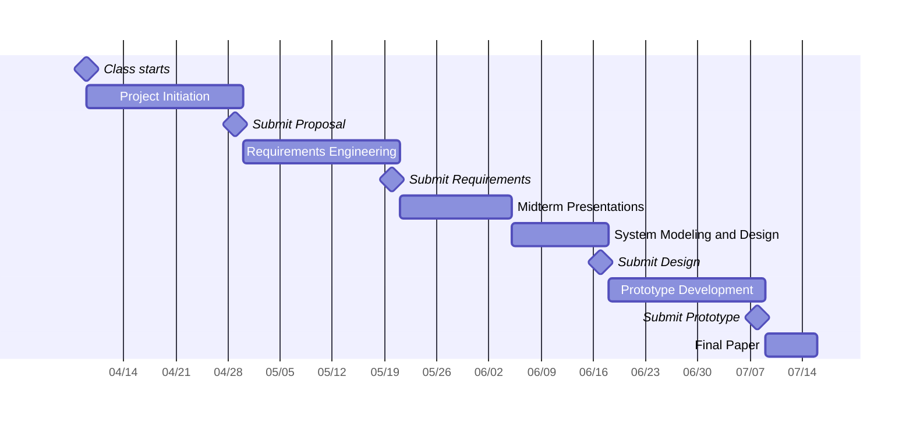

# Schedule and Planning

## Planned Meetings

| Date       | Event                      |
|------------|----------------------------|
| 2024-04-09 | In-Class Meeting           |
| 2024-04-10 | P4 Scheduled Meeting       |
| 2024-04-12 | P4 Scheduled Meeting       |
| 2024-04-16 | In-Class Meeting           |
| 2024-04-17 | P4 Scheduled Meeting       |
| 2024-04-19 | P4 Scheduled Meeting       |
| 2024-04-23 | In-Class Meeting           |
| 2024-04-24 | P4 Scheduled Meeting       |
| 2024-04-26 | P4 Scheduled Meeting       |
| 2024-04-28 | Deliverably 1 Release Call |
| 2024-04-30 | In-Class Meeting           |
| 2024-05-01 | P4 Scheduled Meeting       |
| 2024-05-03 | Off - Happy Golden Week    |
| 2024-05-07 | In-Class Meeting           |
| 2024-05-08 | P4 Scheduled Meeting       |
| 2024-05-10 | P4 Scheduled Meeting       |
