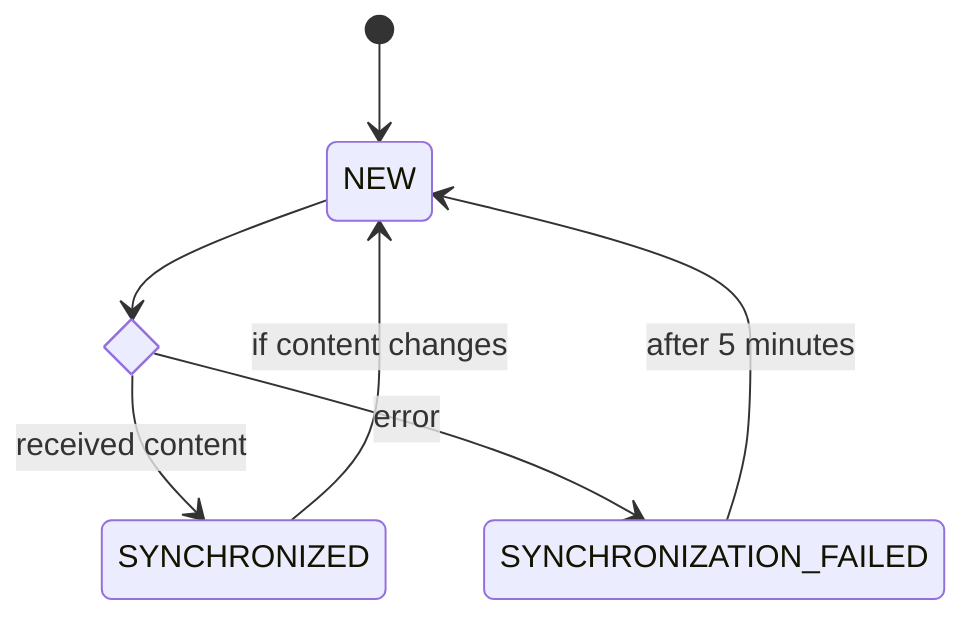
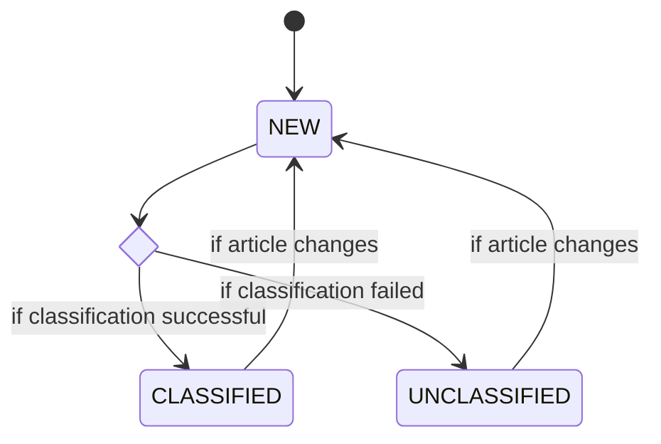

# System Design Document
{: .no_toc }

## Preface

### Version History

| Version | Date       | Description      |
|---------|------------|------------------|
| 1.0     | 2024-06-17 | Initial revision |

## Table of Contents
{: .no_toc }

- TOC
{:toc}

## Introduction

This document is written as a Software Design Document for the "System for Citizen-centric Human Resource Management in Smart Cities" project. It aims to describe how the functional and non-functional requirements documented in the [Requirements Specification](/requirements-specification.md) can be transformed into a working application by specifying both the high-level system design and low-level detailed design.

## General Overview

### System Context

## System Architecture

The system will follow a three-tier architecture, splitting the user interface (presentation tier), backend services (application tier), and database (data tier) across three different logical host groups. Communication between the presentation and application tiers will take place using REST over HTTP.

Additionally, the system will interact with a variety of external actors and systems. This document contains a detailed description of each of these integrations, but the following diagram may be used as a summary view.

### Bounded Contexts

Due to our relatively wide set of functionality, this system design loosely follows the practices of Domain-Driven-Design (DDD) to avoid the complexities presented by using a single unified model. The system is structured as a series of "vertical slices", each one dealing primarily with a single bounded context. The following table documents these bounded contexts.

| Context           | Description                                                   |
|-------------------|---------------------------------------------------------------|
| Analytics         | Primarily deals with clickstream analytics and reporting.     |
| Certifications    | Similar to learning material, utilizes careeronestop dataset. |
| Demand            | Employment target for a given occupation.                     |
| Employment        | Number of people employed in an occupation for a given year.  |
| Job Postings      | Feed of job postings relating to an occupation.               |
| Learning Material | CMS-managed learning content for citizen consumption.         |
| News              | Aggregated news articles from various open RSS feeds.         |
| Occupations       | Occupation descriptions and metadata from 2018 SOC.           |
| Unemployment      | Unemployment level for a given year.                          |

These boundaries span all three of the application tiers, but are most heavily relied upon in the application tier, where they heavily shaped the design of the system.

### Presentation Tier

The presentation tier of this system consists of a Vue single page application deployed to and served directly from a CDN.

| Purpose              | Library or Framework |
|----------------------|----------------------|
| Programming Language | Typescript           |
| App Framework        | Vue                  |
| Test Framework       | Vitest               |
| Build System         | Vite                 |

#### Component Architecture

The presentation tier is structured as a set of reusable components, which are composed into individual views that the user may interact with. A complete catalogue of components and views is available in the UI section of this document.

### Application Tier

The application tier of this system consists of a single Spring Boot service bundled as an OCI image and deployed to a managed kubernetes-based container orchestration platform.

| Purpose              | Library or Framework |
|----------------------|----------------------|
| Programming Language | Java                 |
| App Framework        | Spring + Spring Boot |
| Test Framework       | JUnit                |
| Build System         | Apache Maven         |

#### Vertical Slice Architecture

Mirroring the bounded contexts described above, the application tier will be composed of a series of "vertical slices", each of which spans the traditional presentation, business, and data layers. This aims to reduce dependencies between each bounded context to allow for independent development and testing.

### Data Tier

The data tier of this system consists of a single instance of Postgres managed by a cloud provider. Schema migrations will be handled using a code-based approach; the database structure will be embedded in the application-tier container and automatically applied at startup using liquibase.

| Purpose           | Library or Framework |
|-------------------|----------------------|
| Database Platform | Postgres             |
| Management Tool   | Liquibase            |

## Presentation Tier Design

### View Transition State Diagram

### View Catalogue

#### CertificationInformationView

#### CertificationView

#### DeleteAccountView

#### DownloadReportDataView

#### ExploreAllOccupationView

#### ExploreOccupationsView

#### HomePageView

#### InformationView

#### JobView

#### LearningInformationView

#### LearningView

#### ManageDemandView

#### NewsView

#### ProfileHomePageView

#### ProfileView

#### ReportTypeView

#### ReportsView

#### SelectDetailedOccupationView

#### SelectMajorAndMinorGroupView

### Component Catalogue
#### Breadcrumb

#### Button

#### CertificationsDetails

#### CitizenHeatMap

#### FormInput

#### JobDetails

#### LearningDetails

#### NewsDetails

#### OccupationDataButton

#### Report

#### SelectWithTypeahead

## Application Tier Operations




### {{ controller.title }}
{{ controller.content }}


### Models


#### {{ model.title }}
{{ model.content }}


## Application Tier Design

## Data Tier Design

## Operations

### getCertifications

### notifyEntryPublished

### notifyEntryUnpublished

### getEmploymentBySocCode

### getJobPosting

### getLearningMaterial

### getNews

### getOccupationsBySocCode

### getUnemploymentBySocCode

### deleteCurrentUserProfile

### getCurrentUserProfile

### updateUserProfile

### getDemand

### setDemand

## Accounts / Profiles

### U1 - Create Account
#### Activity Diagram

### U2 - Administer Account
#### Activity Diagram

### U3 - Edit Account Profile
#### Activity Diagram

### U4 - Reset Account Password

### U5 - Delete Account
#### Activity Diagram

### U7 - Select Job Goal
#### Activity Diagram

## Occupations

### U6 - View Occupation Information
#### Activity Diagram

### U8 - View Unemployment Data
#### Activity Diagram

### U9 - View Occupation Trend
#### Activity Diagram

### U14 - View Occupation Demand
#### Activity Diagram

### U16 - Manage Occupation Demand
#### Activity Diagram

## Job Postings

### U10 - View Job Postings
#### Activity Diagram

## Certifications

### U11 - View Certifications
#### Activity Diagram

## Learning Material

### U12 - View Learning Material
#### Activity Diagram

### U13 - Manage Learning Material

#### State Diagram

#### Using Contentful

## News

### U15 - View Occupation News

### Load News

#### State Diagram

#### News Classification

## Reporting

### U17 - View Analytics Reports
#### Activity Diagram
