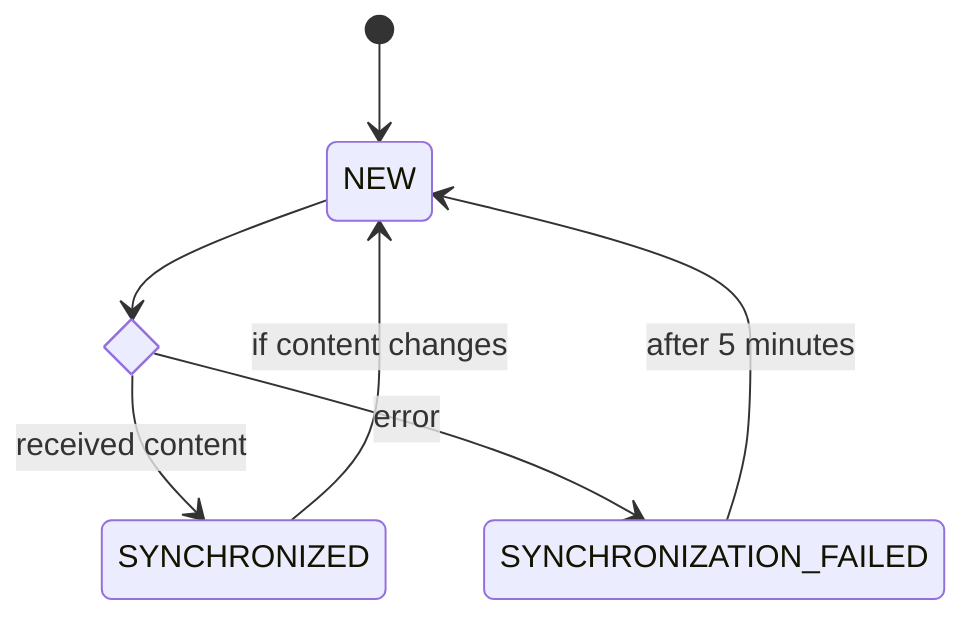
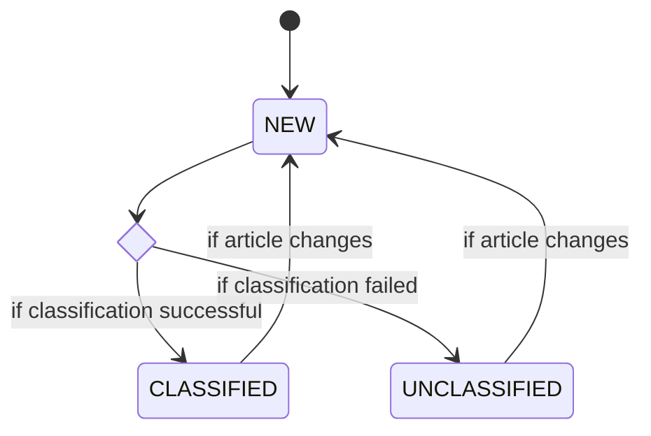

# System Design Document
{: .no_toc }

## Preface

### Version History

| Version | Date       | Description      |
|---------|------------|------------------|
| 1.0     | 2024-06-17 | Initial revision |

## Table of Contents
{: .no_toc }

- TOC
{:toc}

## Introduction

This document is written as a Software Design Document for the "System for Citizen-centric Human Resource Management in Smart Cities" project. It aims to describe how the functional and non-functional requirements documented in the [Requirements Specification](/requirements-specification.md) can be transformed into a working application by specifying both the high-level system design and low-level detailed design.

## General Overview

### System Context

## System Architecture

The system will follow a three-tier architecture, splitting the user interface (presentation tier), backend services (application tier), and database (data tier) across three different logical host groups. Communication between the presentation and application tiers will take place using REST over HTTP.

Additionally, the system will interact with a variety of external actors and systems. This document contains a detailed description of each of these integrations, but the following diagram may be used as a summary view.

### Bounded Contexts

Due to our relatively wide set of functionality, this system design loosely follows the practices of Domain-Driven-Design (DDD) to avoid the complexities presented by using a single unified model. The system is structured as a series of "vertical slices", each one dealing primarily with a single bounded context. The following table documents these bounded contexts.

| Context           | Description                                                   |
|-------------------|---------------------------------------------------------------|
| Analytics         | Primarily deals with clickstream analytics and reporting.     |
| Certifications    | Similar to learning material, utilizes careeronestop dataset. |
| Demand            | Employment target for a given occupation.                     |
| Employment        | Number of people employed in an occupation for a given year.  |
| Job Postings      | Feed of job postings relating to an occupation.               |
| Learning Material | CMS-managed learning content for citizen consumption.         |
| News              | Aggregated news articles from various open RSS feeds.         |
| Occupations       | Occupation descriptions and metadata from 2018 SOC.           |
| Unemployment      | Unemployment level for a given year.                          |
| Users             | User profiles                                                 |

These boundaries span all three of the application tiers, but are most heavily relied upon in the application tier, where they heavily shaped the design of the system.

### Presentation Tier

The presentation tier of this system consists of a Vue single page application deployed to and served directly from a CDN.

| Purpose              | Library or Framework |
|----------------------|----------------------|
| Programming Language | Typescript           |
| App Framework        | Vue                  |
| Test Framework       | Vitest               |
| Build System         | Vite                 |

#### Component Architecture

The presentation tier is structured as a set of reusable components, which are composed into individual views that the user may interact with. A complete catalogue of components and views is available in the UI section of this document.

### Application Tier

The application tier of this system consists of a single Spring Boot service bundled as an OCI image and deployed to a managed kubernetes-based container orchestration platform.

| Purpose              | Library or Framework |
|----------------------|----------------------|
| Programming Language | Java                 |
| App Framework        | Spring + Spring Boot |
| Test Framework       | JUnit                |
| Build System         | Apache Maven         |

#### Vertical Slice Architecture

Mirroring the bounded contexts described above, the application tier will be composed of a series of "vertical slices", each of which spans the traditional presentation, business, and data layers. This aims to reduce dependencies between each bounded context to allow for independent development and testing.

### Data Tier

The data tier of this system consists of a single instance of Postgres managed by a cloud provider. Schema migrations will be handled using a code-based approach; the database structure will be embedded in the application-tier container and automatically applied at startup using liquibase.

| Purpose           | Library or Framework |
|-------------------|----------------------|
| Database Platform | Postgres             |
| Management Tool   | Liquibase            |

## Presentation Tier Design

### View Transition State Diagram

### View Catalogue

This section includes a complete list of all user interface views provided by the application.

#### CertificationInformationView

Name
: CertificationInformationView

Description
: View detailed information and links to external resources relating to a single certification.

Use Cases
: U11

Requirements
: FREQ-12

#### CertificationView

#### DeleteAccountView

#### DownloadReportDataView

#### ExploreAllOccupationView

#### ExploreOccupationsView

#### HomePageView

#### InformationView

#### JobView

#### LearningInformationView

#### LearningView

#### ManageDemandView

#### NewsView

#### ProfileHomePageView

#### ProfileView

#### ReportTypeView

#### ReportsView

#### SelectDetailedOccupationView

#### SelectMajorAndMinorGroupView

### Component Catalogue
#### Breadcrumb

#### Button

#### CertificationsDetails

#### CitizenHeatMap

#### FormInput

#### JobDetails

#### LearningDetails

#### NewsDetails

#### OccupationDataButton

#### Report

#### SelectWithTypeahead

## Application Tier Operations




### {{ controller.title }}
{{ controller.content }}


### Models


#### {{ model.title }}
{{ model.content }}


## Application Tier Design

## Data Tier Design

## Operational Scenarios

This section describes scenarios that show how the system will be utilized to meet its functional requirements. Each scenario is illustrated by a use case.

### Overview

| Number | Name                            | Description                                                                                                             | Associated FREQ   |
|--------|---------------------------------|-------------------------------------------------------------------------------------------------------------------------|-------------------|
| U1     | Create Account                  | Register an account on the system                                                                                       | FREQ-1            |
| U2     | Administer Account              | Administer an account and assign a role                                                                                 | FREQ-2            |
| U3     | Edit Account Profile            | Edit profile to change profile information such as legal name, occupation, location                                     | FREQ-3            |
| U4     | Reset Account Password          | Reset and recover account's password                                                                                    | FREQ-4            |
| U5     | Delete Account                  | Delete account from the system                                                                                          | FREQ-5            |
| U6     | View Occupation Information     | View general information about each occupation, such as a title, description, and illustrative examples                 | FREQ-6 - FREQ-7   |
| U7     | Select Goal Job                 | Select an occupation as the preferred goal job                                                                          | FREQ-8, FREQ-6    |
| U8     | View Unemployment Data          | View historical unemployment data                                                                                       | FREQ-9            |
| U9     | View Occupation Trend           | View historical data and estimated trend forecast for a given occupation                                                | FREQ-10, FREQ-6   |
| U10    | View Job Postings               | View job postings for a given occupation                                                                                | FREQ-11, FREQ-6   |
| U11    | View Certifications Information | View applicable certifications for a given occupation                                                                   | FREQ-12, FREQ-6   |
| U12    | View Learning Material          | View applicable online learning material for a given occupation                                                         | FREQ-13, FREQ-6   |
| U13    | Manage Learning Material        | Create, update, remove online learning material for a given occupation on the system                                    | FREQ-14, FREQ-6   |
| U14    | View Occupation Demands         | View the targeted change in employment for a given occupation                                                           | FREQ-16, FREQ-6   |
| U15    | View Occupation News            | View news from various sources associated with a given occupation                                                       | FREQ-15, FREQ-6   |
| U16    | Manage Occupation Demands       | Set demand targets for a given occupation                                                                               | FREQ-17, FREQ-6   |
| U17    | View Analytics Report           | View a generated report on aggregated data of citizens' information and engagement activity with content on the website | FREQ-18 - FREQ-32 |

### U1 - Create Account

#### Activity Diagram

### U2 - Administer Account

#### Activity Diagram

### U3 - Edit Account Profile

#### Activity Diagram

### U4 - Reset Account Password

### U5 - Delete Account

#### Activity Diagram

### U6 - View Occupation Information

#### Activity Diagram

### U7 - Select Job Goal

#### Activity Diagram

### U8 - View Unemployment Data

#### Activity Diagram

### U9 - View Occupation Trend

#### Activity Diagram

### U10 - View Job Postings

#### Activity Diagram

### U11 - View Certification Information

#### Activity Diagram

### U12 - View Learning Material

#### Activity Diagram

### U13 - Manage Learning Material

#### Activity Diagram

### U14 - View Occupation Demand

#### Activity Diagram

### U15 - View Occupation News

### U16 - Manage Occupation Demand

#### Activity Diagram

### U17 - View Analytics Reports

#### Activity Diagram

## External Interfaces

### Auth0

Auth0 is an identity and access management (IdAM) provider that manages authentication and authorization using the oauth2 protocol.

#### Integration Details

Auth0 is fully standards compliant - as such we need only follow the procedures defined in [The OAuth2 specification](https://oauth.net/2/).

### BLS Public Data API

The BLS Public Data Application Programming Interface (API) is an application designed to allow third party programmers, developers, and organizations to retrieve published historical time series data in JSON data-interchange format or as an Excel spreadsheet. Using Public Data API signatures, users can consume and manipulate raw data from all of the Bureau’s surveys to create a wide range of applications that conform to W3C standards and accepted practices. The BLS Public Data API does not require registration and is open for public use.

### Contentful

Contentful is a versatile content platform designed to help brands manage and deliver content efficiently. Used by many enterprise brands, it allows developers and creators to independently build, reuse, and connect content, integrating design and scaling projects quickly within a unified system.

Contentful features user-friendly interfaces suited for various contributors, including developers, editors, marketers, and writers, making it easy for teams to collaborate and create engaging experiences.

### RSS (Various Sources)

RSS is a web feed that allows users and applications to access updates to websites in a standardized, computer-readable format. The system will leverage it to pull recent news articles from various sources to be classified and displayed in the application.

#### Integration Details

All streams will operate as described in [the RSS specification](https://www.rssboard.org/rss-specification).

#### List of Feeds

| Source         | URL                                                                  |
|----------------|----------------------------------------------------------------------|
| New York Times | https://rss.nytimes.com/services/xml/rss/nyt/Business.xml            |
| New York Times | https://rss.nytimes.com/services/xml/rss/nyt/EnergyEnvironment.xml   |
| New York Times | https://rss.nytimes.com/services/xml/rss/nyt/SmallBusiness.xml       |
| New York Times | https://rss.nytimes.com/services/xml/rss/nyt/Economy.xml             |
| New York Times | https://rss.nytimes.com/services/xml/rss/nyt/Dealbook.xml            |
| New York Times | https://rss.nytimes.com/services/xml/rss/nyt/MediaandAdvertising.xml |
| New York Times | https://rss.nytimes.com/services/xml/rss/nyt/YourMoney.xml           |
| New York Times | https://rss.nytimes.com/services/xml/rss/nyt/Technology.xml          |
| New York Times | https://rss.nytimes.com/services/xml/rss/nyt/PersonalTech.xml        |
| New York Times | https://rss.nytimes.com/services/xml/rss/nyt/Sports.xml              |
| New York Times | https://rss.nytimes.com/services/xml/rss/nyt/Science.xml             |
| New York Times | https://rss.nytimes.com/services/xml/rss/nyt/Climate.xml             |
| DailyMail      | https://www.dailymail.co.uk/articles.rss                             |
| DailyMail      | https://www.dailymail.co.uk/news/index.rss                           |
| DailyMail      | https://www.dailymail.co.uk/ushome/index.rss                         |
| DailyMail      | https://www.dailymail.co.uk/sport/index.rss                          |
| DailyMail      | https://www.dailymail.co.uk/home/index.rss                           |
| DailyMail      | https://www.dailymail.co.uk/health/index.rss                         |
| DailyMail      | https://www.dailymail.co.uk/sciencetech/index.rss                    |
| DailyMail      | https://www.dailymail.co.uk/money/index.rss                          |
| DailyMail      | https://www.dailymail.co.uk/tvshowbiz/index.rss                      |
| DailyMail      | https://www.dailymail.co.uk/video/videos.rss                         |

### USAJobs

USAJobs.gov offers a free API for searching job postings for US federal jobs.

## Placeholder

## Appendix A - Large Format Diagrams

The diagrams in this section are useful for understanding the system's overall design but are difficult to view in a normal document. To view these diagrams, right click on them and open them in a new tab. From there, you can use your browser's zooming and panning capabilities to explore them in detail.

### Composite Application Tier Class Diagram

### Composite View Mockups / State Transitions

Note that the colors are strictly for readability and have no specific meaning.