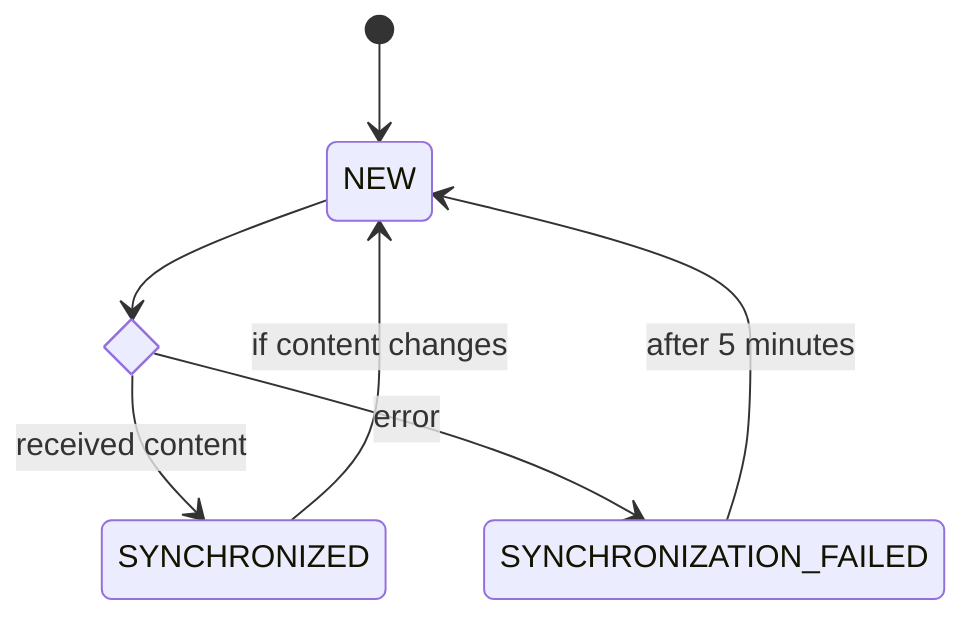
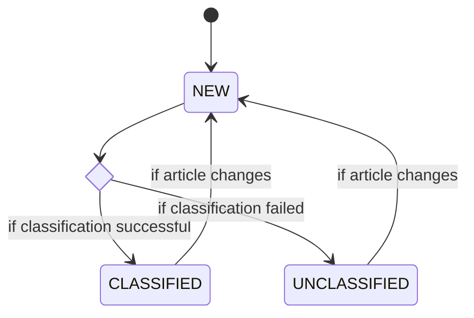

# System Design Diagrams

## UI

## Backend

### Operations

#### getCertifications

#### notifyEntryPublished

#### notifyEntryUnpublished

#### getEmploymentBySocCode

#### getJobPosting

#### getLearningMaterial

#### getNews

#### getOccupationsBySocCode

#### getUnemploymentBySocCode

#### deleteCurrentUserProfile

#### getCurrentUserProfile

#### updateUserProfile

#### getDemand

#### setDemand

## Accounts / Profiles

### U1 - Create Account
#### Activity Diagram

### U2 - Administer Account
#### Activity Diagram

### U3 - Edit Account Profile
#### Activity Diagram

### U4 - Reset Account Password

### U5 - Delete Account
#### Activity Diagram

### U7 - Select Job Goal
#### Activity Diagram

## Occupations

### U6 - View Occupation Information
#### Activity Diagram

### U8 - View Unemployment Data
#### Activity Diagram

### U9 - View Occupation Trend
#### Activity Diagram

### U14 - View Occupation Demand
#### Activity Diagram

### U16 - Manage Occupation Demand
#### Activity Diagram

## Job Postings

### U10 - View Job Postings
#### Activity Diagram

## Certifications

### U11 - View Certifications
#### Activity Diagram

## Learning Material

### U12 - View Learning Material
#### Activity Diagram

### U13 - Manage Learning Material

#### State Diagram

#### Using Contentful

## News

### U15 - View Occupation News

### Load News

#### State Diagram

#### News Classification

## Reporting

### U17 - View Analytics Reports
#### Activity Diagram

