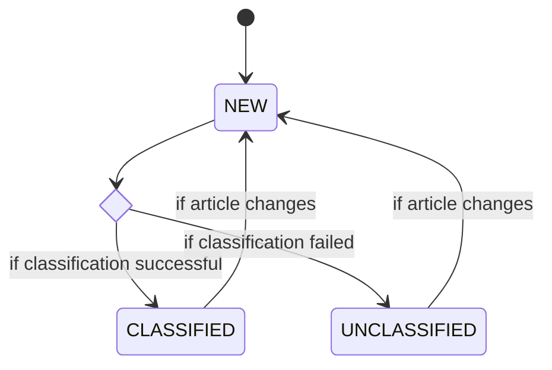

# System Design Diagrams

## Accounts / Profiles

### U1 - Create Account

### U2 - Administer Account

### U3 - Edit Account Profile

### U4 - Reset Account Password

### U5 - Delete Account

### U7 - Select Job Goal

## Occupations

### U6 - View Occupation Information

### U8 - View Unemployment Data

### U9 - View Occupation Trend

### U14 - View Occupation Demand

### U16 - Manage Occupation Demand

## Job Postings

### U10 - View Job Postings

## Certifications

### U11 - View Certifications

## Learning Material

### U12 - View Learning Material

### U13 - Manage Learning Material

## News

### U15 - View Occupation News

### Load News

#### State Diagram

## Reporting

### U17 - View Analytics Reports
