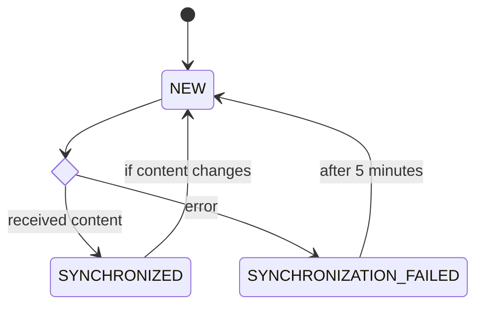
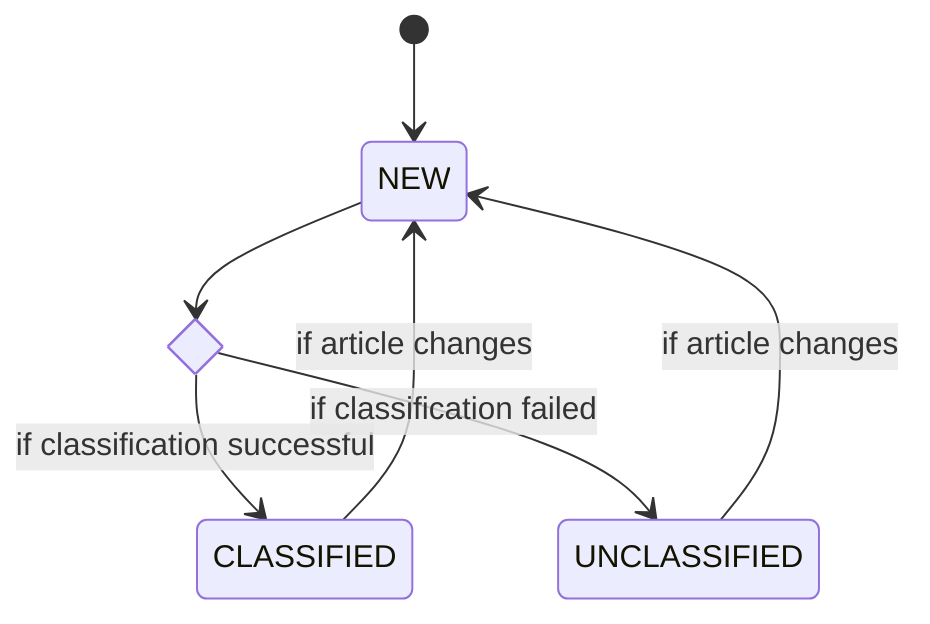

# System Design Document
{: .no_toc }

## Preface

### Version History

| Version | Date       | Description      |
|---------|------------|------------------|
| 1.0     | 2024-06-17 | Initial revision |

## Table of Contents
{: .no_toc }

- TOC
{:toc}

## Introduction

This document is written as a Software Design Document for the "System for Citizen-centric Human Resource Management in Smart Cities" project. It aims to describe how the functional and non-functional requirements documented in the [Requirements Specification](/requirements-specification.md) can be transformed into a working application by specifying both the high-level system design and low-level detailed design.

## General Overview

### System Context


## System Architecture

This section of the document describes the general architecture of the system and lists architectural patterns that the overarching design or specific components will follow. It takes a high-level view of the system and is suitable for orientation; more specific details are available in the documentation for the individual tiers.

### System Tiers and General Architecture

The system will follow a three-tier architecture, splitting the user interface (presentation tier), backend services (application tier), and database (data tier) across three different logical host groups.

The presentation tier will consist of a single page application (SPA) written primarily using Vue.js. It will be structured following a **component-based architecture**, wherein interactable elements are defined as reusable **Components**, which are then composed into **Views** that implement one or more use cases.

Between the presentation and application tiers, a virtual tier henceforth referred to as the HTTP Application Programming Interface (API) exists. While this is physically part of the application tier, it can logically be considered the bridge between the presentation and application tiers. It provides a set of **Operations** that are implemented by the application tier and consumed by the presentation tier to power the various views and components of the latter.

The application tier will consist of a modular monolith written primarily using Spring Boot. Internally, it will follow a **three-layer architecture**: a presentation layer utilizing spring-web-mvc, an application layer written primarily in plain Java, and a data-access layer implemented via spring-data.

The data tier will consist of an instance of Postgres with the `timescaledb` extension enabled to facilitate high-performance analytics ingestion and processing.


### Vertical Slicing

Due to the wide array of domain objects needed to meet the functional requirements of the system, treating individual tiers as monolithic blocks presents significant organizational challenges in the implementation and maintenance of the system. While the presentation tier is able to achieve loose coupling due to its component-based architecture, the same cannot be said for the application tier. Were it to be designed as a single model, significant time would be lost to inter-developer interference. Traditionally, a microservice architecture could be utilized to work around these constraints, but due to the limited development period afforded to this project it is impossible to achieve the process maturity required to deploy and monitor a large number of services.

Despite these limitations, some benefit can still be obtained by loosely following the practices of **Domain-Driven-Design**. Instead of treating the application tier as a single, unified model, this system design instead splits the domain into a set of bounded contexts, each of which is isolated in its own **vertical slice**.

| Context           | Description                                                   |
|-------------------|---------------------------------------------------------------|
| Analytics         | Primarily deals with clickstream analytics and reporting.     |
| Certifications    | Similar to learning material, utilizes careeronestop dataset. |
| Demand            | Employment target for a given occupation.                     |
| Employment        | Number of people employed in an occupation for a given year.  |
| Job Postings      | Feed of job postings relating to an occupation.               |
| Learning Material | CMS-managed learning content for citizen consumption.         |
| News              | Aggregated news articles from various open RSS feeds.         |
| Occupations       | Occupation descriptions and metadata from 2018 SOC.           |
| Unemployment      | Unemployment level for a given year.                          |
| Users             | User profiles                                                 |

To achieve the full benefits of domain-driven-design, it is important to enforce design constraints around inter-domain communication to limit coupling. Each vertical slice may only interact with its peers at a particular layer, in this case the application business layer.


By siloing each bounded context and providing strict guidelines around inter-domain communication, the system can be effectively developed in parallel; each domain is small enough to be implemented by a single developer and can be tested completely in isolation.

### Illustrative Example

To better understand the design language used in the remainder of this document, let's look at an illustrative example. This example will show the full end-to-end structure of a single operation within the fictitious *Example* bounded context and the process we could take to learn more about specific parts of it.

As mentioned above, the presentation tier consists of a set of loosely coupled **Components** which are composed into **Views**. In this case, we will focus on the *ExampleView*, which has a dependency on the **Operation** *getExample()*. Were this a real view, it could be found in the [View Catalogue](#view-catalog) and would be diagrammed similar to the following:


To trace this into the application tier, we will next look to the [HTTP API](#http-api) section. Within this section, we will look for the *ExampleController* subsection (these will generally follow the pattern `<BoundedContext>Controller`), which will contain a UML class diagram showing the structure of the application tier implementation of this **Operation**. Scrolling down to the specific operation, in this case `getExample()`, we will find a UML sequence diagram showing how these classes interact. Putting this all together, we reach the following structure:


Having read these sections, we should now have a good understanding of how the operation is defined both structurally and procedurally, but we may not yet have a full understanding of the internal behaviour of the classes. If a bounded context is non-trivial, additional implementation details will be available in the [Application Tier Design](#application-tier-design) and [Data Tier Design](#data-tier-design) sections of the document.

### System Boundaries and External Interfaces

The boundary of the system contains all three physical tiers of the application, as well as the virtual HTTP API tier. The system provides two interfaces through which external systems and entities can interact with it; a visual interface referred to as the **Web Frontend** for consumption by humans, and a machine-to-machine interface referred to as the **HTTP API** for consumption by external systems.

Additionally, the system integrates with a variety of third party services using their APIs. Details about these integrations can be found in the [External Interfaces](#external-interfaces) section of this document.


## Presentation Tier Design

### View Transition State Diagram


### View Catalog

This section includes a complete list of all user interface views provided by the application.

#### CertificationInformationView

Name
: CertificationInformationView

Description
: View detailed information and links to external resources relating to a single certification.

User Type
: Smart City Managers, Citizens


#### CertificationView

Name
: CertificationView

Description
: View a list of certifications from organizations while being able to sort through each certification

User Type
: Smart City Managers, Citizens


#### DeleteAccountView

Name
: DeleteAccountView

Description
: Ensures the capability to delete an account upon request

User Type
: Citizens, System Administrators


#### DownloadReportDataView

Name
: DownloadReportDataView

Description
: Enables the ability to download data for all types of reports

User Type
: Smart City Managers


#### ExploreAllOccupationView

Name
: ExploreAllOccupationsView

Description
: Provide access to data on unemployment, current occupations, and locations of all citizens. Ensures the capability to view employment statistics and the demand for each major occupation.

User Type
: Smart City Managers, Citizens


#### ExploreOccupationsView

Name
: ExploreOccupationsView

Description
: View detailed information on minor groups, broad occupations, and specific occupations, along with related content. Ensures the capability to explore deeper levels of SOC codes when available.

User Type
: Smart City Managers, Citizens


#### HomePageView

Name
: HomePageView

Description
: View information about the application and enables the capability to sign in or register

User Type
: Smart City Managers, Citizens


#### InformationView

Name
: InformationView

Description
: View employment trends, occupational data, and information for major groups, minor groups, or broad occupations

User Type
: Smart City Managers, Citizens


#### JobView

Name
: JobView

Description
: View job postings information for occupations while utilizing sorting and filtering capabilities

User Type
: Smart City Managers, Citizens


#### LearningInformationView

Name
: LearningInformationView

Description
: View detailed information and links to external resources relating to a single learning resource

User Type
: Smart City Managers, Citizens


#### LearningView

Name
: LearningView

Description
: View learning resources information for occupations while utilizing sorting and filtering capabilities

User Type
: Smart City Managers, Citizens


#### ManageDemandView

Name
: ManageDemandView

Description
: Enable city managers to input required demand for occupations and view current demand and employment trends

User Type
: Smart City Managers


#### NewsView

Name
: NewsView

Description
: View news information for occupations while utilizing sorting and filtering capabilities

User Type
: Smart City Managers, Citizens


#### ProfileHomePageView

Name
: ProfileHomePageView

Description
: Enable users to take various actions regarding their information, such as editing current jobs, exploring occupations, downloading report data, and deleting their account

User Type
: Smart City Managers, Citizens


#### ProfileView

Name
: ProfileView

Description
: Enable users to input or update their personal information and save it

User Type
: Smart City Managers, Citizens


#### ReportTypeView

Name
: ReportTypeView

Description
: View a list of report types related to occupations and associated content

User Type
: Smart City Managers


#### ReportsView

Name
: ReportsView

Description
: View sub-occupation data, user locations, and heatmaps comparing current and goal occupations for a single occupation

User Type
: Smart City Managers


#### SelectDetailedOccupationView

Name
: SelectDetailedOccupationView

Description
: View information on a specific detailed occupation and have the capability to select it as a user's current job, as well as learn more about it

User Type
: Citizens


#### SelectMajorAndMinorGroupView

Name
: SelectMajorAndMinorGroupView

Description
: View and select from a list of major groups, and then choose from minor groups

User Type
: Citizens


### Component Catalog

#### Breadcrumb

Name
: Breadcrumb

Description
: Control element used as a navigational aid to sho users which page they currently are in


#### Button

Name
: Button

Description
: Clickable graphical element that is interactable to trigger actions or navigate from one page to another


#### CertificationsDetails

Name
: CertificationDetails

Description
: A text box with various information about a single certification such as organization, title, and a button that navigates users to CertificationInformationView


#### FormInput

Name
: FormInput

Description
: A field where users enter data, such as text, numbers, or selections, to submit information or perform actions within the application


#### JobDetails

Name
: JobDetails

Description
: A text box with various information about a single job posting such as salary range, deadline, description, title, company, location, and a button that navigates users to an external source where the job posting is located


#### LearningDetails

Name
: LearningDetails

Description
: A text box with various information about a single learning material such as organization, content type, title, and a button that nagivates users to LearningInformationView


#### NewsDetails

Name
: NewsDetails

Description
: A text box with various information about a single news source such as published date, organization, title, and a button that nagivates users to an external source where the news article is located 


#### OccupationDataButton

Name
: OccupationDataButton

Description
: A button that provides information on employment trends and demand requirements, and is clickable to navigate users through the hierarchical levels of SOC codes


#### Report

Name
: Report

Description
: A webpage displaying various types of reports (Citizen Current Job Report, Citizen Goals Job Report, Job Postings Report, News Engagement Report, Certification Engagement Report, and Learning Material Engagement Report) with Each report containing detailed information such as the number of individuals in specific occupations, sub-occupation breakdowns, and user location heat maps categorized by occupation. Furthermore, these reports are available for users to download.


#### SelectWithTypeahead

Name
: SelectWithTypeahead

Description
: An element that combines a dropdown menu with an autosuggesting feature, allowing users to filter and select options by typing part of the desired item's name


#### Chart

Name
: Chart

Description
: A graphical method of representing various types of statistical data through formats such as line graphs, pie charts, heatmaps, and maps


## HTTP API




### {{ controller.title }}
{{ controller.content }}


## Application Tier Design

## Data Tier Design

## Operational Scenarios

This section describes scenarios that show how the system will be utilized to meet its functional requirements. Each scenario is illustrated by a use case.

### Overview


| Number | Name                            | Description                                                                                                             | Associated FREQ   |
|--------|---------------------------------|-------------------------------------------------------------------------------------------------------------------------|-------------------|
| U1     | Create Account                  | Register an account on the system                                                                                       | FREQ-1            |
| U2     | Administer Account              | Administer an account and assign a role                                                                                 | FREQ-2            |
| U3     | Edit Account Profile            | Edit profile to change profile information such as legal name, occupation, location                                     | FREQ-3            |
| U4     | Reset Account Password          | Reset and recover account's password                                                                                    | FREQ-4            |
| U5     | Delete Account                  | Delete account from the system                                                                                          | FREQ-5            |
| U6     | View Occupation Information     | View general information about each occupation, such as a title, description, and illustrative examples                 | FREQ-6 - FREQ-7   |
| U7     | Select Goal Job                 | Select an occupation as the preferred goal job                                                                          | FREQ-8, FREQ-6    |
| U8     | View Unemployment Data          | View historical unemployment data                                                                                       | FREQ-9            |
| U9     | View Occupation Trend           | View historical data and estimated trend forecast for a given occupation                                                | FREQ-10, FREQ-6   |
| U10    | View Job Postings               | View job postings for a given occupation                                                                                | FREQ-11, FREQ-6   |
| U11    | View Certifications Information | View applicable certifications for a given occupation                                                                   | FREQ-12, FREQ-6   |
| U12    | View Learning Material          | View applicable online learning material for a given occupation                                                         | FREQ-13, FREQ-6   |
| U13    | Manage Learning Material        | Create, update, remove online learning material for a given occupation on the system                                    | FREQ-14, FREQ-6   |
| U14    | View Occupation Demands         | View the targeted change in employment for a given occupation                                                           | FREQ-16, FREQ-6   |
| U15    | View Occupation News            | View news from various sources associated with a given occupation                                                       | FREQ-15, FREQ-6   |
| U16    | Manage Occupation Demands       | Set demand targets for a given occupation                                                                               | FREQ-17, FREQ-6   |
| U17    | View Analytics Report           | View a generated report on aggregated data of citizens' information and engagement activity with content on the website | FREQ-18 - FREQ-32 |

### U1 - Create Account

#### Activity Diagram


### U2 - Administer Account

#### Activity Diagram


### U3 - Edit Account Profile

#### Activity Diagram


### U4 - Reset Account Password

#### Activity Diagram


### U5 - Delete Account

#### Activity Diagram


### U6 - View Occupation Information

#### Activity Diagram


### U7 - Select Job Goal

#### Activity Diagram


### U8 - View Unemployment Data

#### Activity Diagram


### U9 - View Occupation Trend

#### Activity Diagram


### U10 - View Job Postings

#### Activity Diagram


### U11 - View Certification Information

#### Activity Diagram


### U12 - View Learning Material

#### Activity Diagram


### U13 - Manage Learning Material

#### Activity Diagram


### U14 - View Occupation Demand

#### Activity Diagram


### U15 - View Occupation News

### U16 - Manage Occupation Demand

#### Activity Diagram


### U17 - View Analytics Reports

#### Activity Diagram


## External Interfaces

### Auth0

Auth0 is an identity and access management (IdAM) provider that manages authentication and authorization using the oauth2 protocol.

#### Integration Details

Auth0 is fully standards compliant - as such we need only follow the procedures defined in [The OAuth2 specification](https://oauth.net/2/). Additional information can be found in the [Auth0 documentation](https://auth0.com/docs).

### BLS Public Data API

The BLS Public Data Application Programming Interface (API) is an application designed to allow third party programmers, developers, and organizations to retrieve published historical time series data in JSON data-interchange format or as an Excel spreadsheet. Using Public Data API signatures, users can consume and manipulate raw data from all of the Bureau’s surveys to create a wide range of applications that conform to W3C standards and accepted practices. The BLS Public Data API does not require registration and is open for public use.

#### Integration Details

Integration guide can be found in the [BLS developer documentation](https://www.bls.gov/developers/home.htm).

#### Request Sample

```shell
curl --location 'https://api.bls.gov/publicAPI/v1/timeseries/data/' \
--header 'Content-Type: application/json' \
--header 'Cookie: JSESSIONID=5F4C27616F7BDF9BE4EEAF5A245DA9C0' \
--data '{
  "seriesid": ["LNU04000000"],
  "startyear": "2024",
  "endyear": "2024"
}'
```

#### Response Sample

```json
{
  "status": "REQUEST_SUCCEEDED",
  "responseTime": 126,
  "message": [],
  "Results": {
    "series": [
      {
        "seriesID": "LNU04000000",
        "data": [
          {
            "year": "2024",
            "period": "M05",
            "periodName": "May",
            "latest": "true",
            "value": "3.7",
            "footnotes": [
              {}
            ]
          },
          {
            "year": "2024",
            "period": "M04",
            "periodName": "April",
            "value": "3.5",
            "footnotes": [
              {}
            ]
          },
          {
            "year": "2024",
            "period": "M03",
            "periodName": "March",
            "value": "3.9",
            "footnotes": [
              {}
            ]
          },
          {
            "year": "2024",
            "period": "M02",
            "periodName": "February",
            "value": "4.2",
            "footnotes": [
              {}
            ]
          },
          {
            "year": "2024",
            "period": "M01",
            "periodName": "January",
            "value": "4.1",
            "footnotes": [
              {}
            ]
          }
        ]
      }
    ]
  }
}
```

### Contentful

Contentful is a versatile content platform designed to help brands manage and deliver content efficiently. Used by many enterprise brands, it allows developers and creators to independently build, reuse, and connect content, integrating design and scaling projects quickly within a unified system.

#### Integration Details

The system exposes two webhook endpoints to receive notifications when content is published or unpublished. No other interactions are necessary. More details can be found in the [Contentful developer documentation](https://www.contentful.com/developers/docs/).

#### Entry Published Sample Payload

```json
{
  "metadata": {
    "tags": []
  },
  "fields": {
    "title": {
      "en-US": "Test Material"
    },
    "socCodes": {
      "en-US": [
        "11-1011"
      ]
    },
    "description": {
      "en-US": {
        "data": {},
        "content": [
          {
            "data": {},
            "content": [
              {
                "data": {},
                "marks": [],
                "value": "Sample Learning Material",
                "nodeType": "text"
              }
            ],
            "nodeType": "heading-2"
          },
          {
            "data": {},
            "content": [
              {
                "data": {},
                "marks": [],
                "value": "Here's some content! Yay!",
                "nodeType": "text"
              }
            ],
            "nodeType": "paragraph"
          },
          {
            "data": {},
            "content": [
              {
                "data": {},
                "marks": [],
                "value": "",
                "nodeType": "text"
              }
            ],
            "nodeType": "paragraph"
          }
        ],
        "nodeType": "document"
      }
    },
    "externalLinks": {
      "en-US": []
    }
  },
  "sys": {
    "type": "Entry",
    "id": "5d19lTVZTyCONXM8y2LBkz",
    "space": {
      "sys": {
        "type": "Link",
        "linkType": "Space",
        "id": "ai8a3z37eduf"
      }
    },
    "environment": {
      "sys": {
        "id": "master",
        "type": "Link",
        "linkType": "Environment"
      }
    },
    "contentType": {
      "sys": {
        "type": "Link",
        "linkType": "ContentType",
        "id": "learningMaterial"
      }
    },
    "createdBy": {
      "sys": {
        "type": "Link",
        "linkType": "User",
        "id": "4tXOP8kM16rDUICinch1N6"
      }
    },
    "updatedBy": {
      "sys": {
        "type": "Link",
        "linkType": "User",
        "id": "4tXOP8kM16rDUICinch1N6"
      }
    },
    "revision": 2,
    "createdAt": "2024-06-10T01:08:45.670Z",
    "updatedAt": "2024-06-10T01:12:48.279Z"
  }
}
```

#### Entry Unpublished Sample Payload

```json
{
  "sys": {
    "type": "DeletedEntry",
    "id": "5d19lTVZTyCONXM8y2LBkz",
    "space": {
      "sys": {
        "type": "Link",
        "linkType": "Space",
        "id": "ai8a3z37eduf"
      }
    },
    "environment": {
      "sys": {
        "id": "master",
        "type": "Link",
        "linkType": "Environment"
      }
    },
    "contentType": {
      "sys": {
        "type": "Link",
        "linkType": "ContentType",
        "id": "learningMaterial"
      }
    },
    "revision": 1,
    "createdAt": "2024-06-10T01:12:08.553Z",
    "updatedAt": "2024-06-10T01:12:08.553Z",
    "deletedAt": "2024-06-10T01:12:08.553Z"
  }
}
```

### RSS (Various Sources)

RSS is a web feed that allows users and applications to access updates to websites in a standardized, computer-readable format. The system will leverage it to pull recent news articles from various sources to be classified and displayed in the application.

#### Integration Details

All streams will operate as described in [the RSS specification](https://www.rssboard.org/rss-specification).

#### Sample RSS Feed

```xml
<rss
	xmlns:dc="http://purl.org/dc/elements/1.1/"
	xmlns:media="http://search.yahoo.com/mrss/"
	xmlns:atom="http://www.w3.org/2005/Atom"
	xmlns:nyt="http://www.nytimes.com/namespaces/rss/2.0" version="2.0">
	<channel>
		<title>NYT > World News</title>
		<link>https://www.nytimes.com/section/world</link>
		<atom:link href="https://rss.nytimes.com/services/xml/rss/nyt/World.xml" rel="self" type="application/rss+xml"/>
		<description/>
		<language>en-us</language>
		<copyright>Copyright 2024 The New York Times Company</copyright>
		<lastBuildDate>Thu, 13 Jun 2024 02:37:44 +0000</lastBuildDate>
		<pubDate>Thu, 13 Jun 2024 02:06:57 +0000</pubDate>
		<image>
			<title>NYT > World News</title>
			<url>https://static01.nyt.com/images/misc/NYT_logo_rss_250x40.png</url>
			<link>https://www.nytimes.com/section/world</link>
		</image>
		<item>
			<title>Hamas and Israel Face Pressure to Embrace Cease-Fire Adopted by U.N.</title>
			<link>https://www.nytimes.com/2024/06/11/world/middleeast/israel-hamas-ceasefire-plan.html</link>
			<guid isPermaLink="true">https://www.nytimes.com/2024/06/11/world/middleeast/israel-hamas-ceasefire-plan.html</guid>
			<atom:link href="https://www.nytimes.com/2024/06/11/world/middleeast/israel-hamas-ceasefire-plan.html" rel="standout"/>
			<description>Despite positive statements and international urging, neither of the warring parties accepted a U.S.-backed plan to halt the war in Gaza, let displaced Palestinians go home and free hostages.</description>
			<dc:creator>Michael Crowley, Matthew Mpoke Bigg and Thomas Fuller</dc:creator>
			<pubDate>Tue, 11 Jun 2024 23:00:10 +0000</pubDate>
			<category domain="http://www.nytimes.com/namespaces/keywords/des">Palestinians</category>
			<category domain="http://www.nytimes.com/namespaces/keywords/des">Israel-Gaza War (2023- )</category>
			<category domain="http://www.nytimes.com/namespaces/keywords/des">Civilian Casualties</category>
			<category domain="http://www.nytimes.com/namespaces/keywords/des">Peace Process</category>
			<category domain="http://www.nytimes.com/namespaces/keywords/des">International Relations</category>
			<category domain="http://www.nytimes.com/namespaces/keywords/des">Refugees and Displaced Persons</category>
			<category domain="http://www.nytimes.com/namespaces/keywords/des">Terrorism</category>
			<category domain="http://www.nytimes.com/namespaces/keywords/des">Humanitarian Aid</category>
			<category domain="http://www.nytimes.com/namespaces/keywords/des">Kidnapping and Hostages</category>
			<category domain="http://www.nytimes.com/namespaces/keywords/nyt_org">Hamas</category>
			<category domain="http://www.nytimes.com/namespaces/keywords/nyt_org">Security Council (UN)</category>
			<category domain="http://www.nytimes.com/namespaces/keywords/nyt_org">State Department</category>
			<category domain="http://www.nytimes.com/namespaces/keywords/nyt_org">Wall Street Journal</category>
			<category domain="http://www.nytimes.com/namespaces/keywords/nyt_per">Blinken, Antony J</category>
			<category domain="http://www.nytimes.com/namespaces/keywords/nyt_per">Netanyahu, Benjamin</category>
			<category domain="http://www.nytimes.com/namespaces/keywords/nyt_per">Sinwar, Yehya</category>
			<category domain="http://www.nytimes.com/namespaces/keywords/nyt_per">Biden, Joseph R Jr</category>
			<category domain="http://www.nytimes.com/namespaces/keywords/nyt_geo">Gaza Strip</category>
			<category domain="http://www.nytimes.com/namespaces/keywords/nyt_geo">Israel</category>
			<category domain="http://www.nytimes.com/namespaces/keywords/nyt_geo">Jordan</category>
			<media:content height="1800" medium="image" url="https://static01.nyt.com/images/2024/06/11/multimedia/11Mideast-Crisis-Leadall-fgmw/11Mideast-Crisis-Leadall-fgmw-mediumSquareAt3X.jpg" width="1800"/>
			<media:credit>Haitham Imad/EPA, via Shutterstock</media:credit>
			<media:description>A street in Khan Younis, Gaza, on Tuesday.</media:description>
		</item>
	</channel>
</rss>
```

#### List of Feeds

| Source         | URL                                                                  |
|----------------|----------------------------------------------------------------------|
| New York Times | https://rss.nytimes.com/services/xml/rss/nyt/Business.xml            |
| New York Times | https://rss.nytimes.com/services/xml/rss/nyt/EnergyEnvironment.xml   |
| New York Times | https://rss.nytimes.com/services/xml/rss/nyt/SmallBusiness.xml       |
| New York Times | https://rss.nytimes.com/services/xml/rss/nyt/Economy.xml             |
| New York Times | https://rss.nytimes.com/services/xml/rss/nyt/Dealbook.xml            |
| New York Times | https://rss.nytimes.com/services/xml/rss/nyt/MediaandAdvertising.xml |
| New York Times | https://rss.nytimes.com/services/xml/rss/nyt/YourMoney.xml           |
| New York Times | https://rss.nytimes.com/services/xml/rss/nyt/Technology.xml          |
| New York Times | https://rss.nytimes.com/services/xml/rss/nyt/PersonalTech.xml        |
| New York Times | https://rss.nytimes.com/services/xml/rss/nyt/Sports.xml              |
| New York Times | https://rss.nytimes.com/services/xml/rss/nyt/Science.xml             |
| New York Times | https://rss.nytimes.com/services/xml/rss/nyt/Climate.xml             |
| DailyMail      | https://www.dailymail.co.uk/articles.rss                             |
| DailyMail      | https://www.dailymail.co.uk/news/index.rss                           |
| DailyMail      | https://www.dailymail.co.uk/ushome/index.rss                         |
| DailyMail      | https://www.dailymail.co.uk/sport/index.rss                          |
| DailyMail      | https://www.dailymail.co.uk/home/index.rss                           |
| DailyMail      | https://www.dailymail.co.uk/health/index.rss                         |
| DailyMail      | https://www.dailymail.co.uk/sciencetech/index.rss                    |
| DailyMail      | https://www.dailymail.co.uk/money/index.rss                          |
| DailyMail      | https://www.dailymail.co.uk/tvshowbiz/index.rss                      |
| DailyMail      | https://www.dailymail.co.uk/video/videos.rss                         |

### USAJobs

USAJobs.gov offers a free API for searching job postings for US federal jobs.

#### Integration Details

#### Request Sample

```shell
curl --location 'https://data.usajobs.gov/api/search?Keyword=Software%20Development&ResultsPerPage=1&Page=1' \
--header 'Authorization-Key: <secret>' \
--header 'User-Agent: <email>'
```

#### Response Sample

```json
{
    "LanguageCode": "EN",
    "SearchParameters": {},
    "SearchResult": {
        "SearchResultCount": 1,
        "SearchResultCountAll": 802,
        "SearchResultItems": [
            {
                "MatchedObjectId": "793682000",
                "MatchedObjectDescriptor": {
                    "PositionID": "DAFN240818010077",
                    "PositionTitle": "Division Chief (Engineering)",
                    "PositionURI": "https://www.usajobs.gov:443/GetJob/ViewDetails/793682000",
                    "ApplyURI": [
                        "https://www.usajobs.gov:443/GetJob/ViewDetails/793682000?PostingChannelID="
                    ],
                    "PositionLocationDisplay": "Warren, Michigan",
                    "PositionLocation": [
                        {
                            "LocationName": "Warren, Michigan",
                            "CountryCode": "United States",
                            "CountrySubDivisionCode": "Michigan",
                            "CityName": "Warren, Michigan",
                            "Longitude": -83.02852,
                            "Latitude": 42.511116
                        }
                    ],
                    "OrganizationName": "United States Army Futures Command",
                    "DepartmentName": "Department of the Army",
                    "SubAgency": "US Army Combat Capabilities Development Command (DEVCOM) Ground Vehicle Systems Center (GVSC)",
                    "JobCategory": [
                        {
                            "Name": "General Engineering",
                            "Code": "0801"
                        }
                    ],
                    "JobGrade": [
                        {
                            "Code": "DB"
                        }
                    ],
                    "PositionSchedule": [
                        {
                            "Name": "",
                            "Code": "1"
                        }
                    ],
                    "PositionOfferingType": [
                        {
                            "Name": "This position is to be filled as a TEMPORARY position Not-to-Exceed (NTE) 5 Years.",
                            "Code": "15321"
                        }
                    ],
                    "QualificationSummary": "Who May Apply: Only applicants who meet one of the employment authority categories below are eligible to apply for this job. You will be asked to identify which category or categories you meet, and to provide documents which prove you meet the category or categories you selected. See Proof of Eligibility for an extensive list of document requirements for all employment authorities. Current Department of Army Civilian Employees Applying on Time-Limited Assignments In order to qualify, you must meet the education and experience requirements described below. Experience refers to paid and unpaid experience, including volunteer work done through National Service programs (e.g., Peace Corps, AmeriCorps) and other organizations (e.g., professional; philanthropic; religious; spiritual; community; student; social). You will receive credit for all qualifying experience, including volunteer experience. Your resume must clearly describe your relevant experience; if qualifying based on education, your transcripts will be required as part of your application. Additional information about transcripts is in this document. Basic Education Requirement: A. Degree: Bachelor's degree (or higher degree) in engineering. To be acceptable, the program must: (1) lead to a bachelor's degree (or higher degree) in a school of engineering with at least one program accredited by the Accreditation Board for Engineering and Technology (ABET); OR (2) include differential and integral calculus and courses (more advanced than first-year physics and chemistry) in five of the following seven areas of engineering science or physics: (a) statics, dynamics; (b) strength of materials (stress-strain relationships); (c) fluid mechanics, hydraulics; (d) thermodynamics; (e) electrical fields and circuits; (f) nature and properties of materials (relating particle and aggregate structure to properties); and (g) any other comparable area of fundamental engineering science or physics, such as optics, heat transfer, soil mechanics, or electronics. NOTE: You MUST submit a copy of your transcripts. OR B. Combination of Education and Experience: College-level education, training, and/or technical experience that furnished (1) a thorough knowledge of the physical and mathematical sciences underlying engineering, and (2) a good understanding, both theoretical and practical, of the engineering sciences and techniques and their applications to one of the branches of engineering. The adequacy of such background must be demonstrated by one of the following: 1. Professional registration or licensure- Current registration as an Engineer Intern (EI), Engineer in Training (EIT), or licensure as a Professional Engineer (PE) by any State, the District of Columbia, Guam, or Puerto Rico. Absent other means of qualifying under this standard, those applicants who achieved such registration by means other than written test (e.g., State grandfather or eminence provisions) are eligible only for positions that are within or closely related to the specialty field of their registration. For example, an applicant who attains registration through a State Board's eminence provision as a manufacturing engineer typically would be rated eligible only for manufacturing engineering positions. 2. Written Test - Evidence of having successfully passed the Fundamentals of Engineering (FE) examination, or any other written test required for professional registration, by an engineering licensure board in the various States, the District of Columbia, Guam, or Puerto Rico. 3. Specified academic courses- Successful completion of at least 60 semester hours of courses in the physical, mathematical, and engineering sciences and that included the courses specified in A above. The courses must be fully acceptable toward meeting the requirements of an engineering program. 4. Related curriculum- Successful completion of a curriculum leading to a bachelor's degree in an appropriate scientific field, e.g., engineering technology, physics, chemistry, architecture, computer science, mathematics, hydrology, or geology, may be accepted in lieu of a degree in engineering, provided the applicant has had at least 1 year of professional engineering experience acquired under professional engineering supervision and guidance. (You MUST submit a copy of your transcripts along with a letter of reference stating that you have at least 1 year of professional engineering experience acquired under professional engineering supervision and guidance. The letter must be signed by the engineer who provided the professional engineer supervision. It must also include their name, phone number, and list their engineer credentials such as engineer education or professional certificates). NOTE: An applicant who meets the basic requirements as specified in A or B above, except as noted under B.1., may qualify for positions in any branch of engineering unless selective factors indicate otherwise. In addition to meeting the basic requirement above, to qualify for this position you must also meet the qualification requirements listed below: To qualify at the DB-04/GS-14/15 equivalent grade level: Your resume must clearly describe at least one year of specialized experience equivalent to the DB-03 pay band or equivalent grade level (GS-12/13) level in the Federal service which includes; Expertise in the design and development of major vehicle systems and sub-systems, and/or experience planning, directing, or coordinating combat and tactical vehicle engineering programs, projects and phases of projects. Experience working across multiple organizations, and/or experience leading projects or teams, and experience assigning, overseeing and reviewing the work of assigned teams, and resolving technical or operating problems. This definition of specialized experience is typical of work performed at the next lower grade/level position in the federal service (DB-03 pay band or equivalent grade level (GS-12/13)). This position is part of the Combat Capabilities Development Command (CCDC) Ground Vehicle Systems Center (GVSC), Science and Technology Reinvention Laboratory Personnel Management Demonstration Project. CCDC Ground Vehicle Systems Center (GVSC) is participating in an alternative personnel system known as the Personnel Management Demonstration Projection. The DB-04 pay band is equivalent to the GS-14 step 1 through GS-15 step 10 grade levels. You will be evaluated on the basis of your level of competency in the following areas: Interpersonal Skills Leadership Program Management Technical Competence",
                    "PositionRemuneration": [
                        {
                            "MinimumRange": "134751.0",
                            "MaximumRange": "191900.0",
                            "RateIntervalCode": "PA",
                            "Description": "Per Year"
                        }
                    ],
                    "PositionStartDate": "2024-06-04T00:00:00.0000",
                    "PositionEndDate": "2024-06-12T23:59:59.9970",
                    "PublicationStartDate": "2024-06-04T00:00:00.0000",
                    "ApplicationCloseDate": "2024-06-12T23:59:59.9970",
                    "PositionFormattedDescription": [
                        {
                            "Label": "Dynamic Teaser",
                            "LabelDescription": "Hit highlighting for keyword searches."
                        }
                    ],
                    "UserArea": {
                        "Details": {
                            "JobSummary": "About the Position: Serves as a Division Chief, providing direct technical, programmatic and managerial support to the Associate Director (AD), for the US Army Combat Capabilities Development Command (DEVCOM) Ground Vehicle Systems Center (GVSC), located in Warren, Michigan. This position is also being filled under announcement number DAFN240818011929. Flexible Length Modified Renewable Term (FLMRT) employees must apply under announcement number DAFN240818011929 if you wish to be considered.",
                            "WhoMayApply": {
                                "Name": "",
                                "Code": ""
                            },
                            "LowGrade": "4",
                            "HighGrade": "4",
                            "PromotionPotential": "None",
                            "SubAgencyName": "US Army Combat Capabilities Development Command (DEVCOM) Ground Vehicle Systems Center (GVSC)",
                            "OrganizationCodes": "DD/ARAF",
                            "Relocation": "False",
                            "HiringPath": [
                                "fed-competitive"
                            ],
                            "MCOTags": [
                                "NatSec"
                            ],
                            "TotalOpenings": "1",
                            "AgencyMarketingStatement": "This position is located in Warren, Michigan, and is within the US Army Combat Capabilities Development Command (DEVCOM) Ground Vehicle Systems Center (GVSC). Civilian employees serve a vital role in supporting the Army mission. They provide the skills that are not readily available in the military, but crucial to support military operations. The Army integrates the talents and skills of its military and civilian members to form a Total Army. The Army values diversity of perspectives, backgrounds, cultures and skills, which connects employees to organizations that are committed to building an inclusive work environment where they can contribute to their fullest potential. The United States Army Combat Capabilities Development Command (DEVCOM) Ground Vehicle Systems Center (GVSC), located in Warren, Michigan is the U.S. Armed Forces' research and development facility for advanced technology in ground systems. The U.S. Army DEVCOM is a major subordinate command of the United States Army Futures Command (AFC). Current technology focus areas in the Ground Vehicle Systems Center (GVSC) include Power and Mobility, Autonomous Systems, Force Projection, Survivability and Protection, Electronics and Architecture, Cyber Engineering and Software Integration.",
                            "TravelCode": "2",
                            "ApplyOnlineUrl": "https://apply.usastaffing.gov/Application/Apply",
                            "DetailStatusUrl": "https://apply.usastaffing.gov/Application/ApplicationStatus",
                            "MajorDuties": [
                                "Assists the Associate Director (AD) by participating in strategic planning for area of responsibility and implements assigned strategic objectives with a focus on improving operations.",
                                "Recommends to the AD, the establishment/abolishment of teams to meet overall objectives.",
                                "Assigns, oversees and reviews the work of assigned teams, resolving technical or operating problems.",
                                "Oversees budgets managed and executed by teams.",
                                "Serves as a vital link between the teams, customers, AD, CCDC GVSC Executive Committee and PEO/PM.",
                                "Serves as a direct, first-line supervisor to two or more Supervisory Branch Chiefs within the Division, and serves as second-line supervisor to several associates within the organization.",
                                "Assigns work to subordinates based on priorities, difficulty of assignments, and the capabilities of employees.",
                                "Interviews and selects candidates for vacant positions, and serves as the first level for resolution of disciplinary problems and grievances.",
                                "Executes Management Controls for the work unit and reviews standard operating procedures and certifications."
                            ],
                            "Education": "Some federal jobs allow you to substitute your education for the required experience in order to qualify. For this job, you must meet the qualification requirement using experience alone--no substitution of education for experience is permitted. ***NOTE: TRANSCRIPTS ARE REQUIRED even if you are a current federal employee.*** Only degrees from an accredited college or university recognized by the Department of Education are acceptable to meet positive education requirements or to substitute education for experience. For additional information, please go to the Office of Personnel Management (OPM) and U.S. Department of Education websites at - http://www.opm.gov/qualifications and http://www.ed.gov/admins/finaid/accred/index.html FOREIGN EDUCATION: If you are using education completed in foreign colleges or universities to meet the qualification requirements, you must show the education credentials have been evaluated by a private organization that specializes in interpretation of foreign education programs and such education has been deemed equivalent to that gained in an accredited U.S. education program; or full credit has been given for the courses at a U.S. accredited college or university. For further information, visit: https://sites.ed.gov/international/recognition-of-foreign-qualifications/.",
                            "Requirements": "",
                            "Evaluations": "Once the announcement has closed, a review of your application package (resume, supporting documents, and responses to the questionnaire) will be used to determine whether you meet the qualification requirements listed on this announcement. If you are minimally qualified, your resume and supporting documentation will be compared against your responses to the assessment questionnaire to determine your level of experience. If, after reviewing your resume and/or supporting documentation, a determination is made that you have inflated your qualifications and/or experience, you may lose consideration for this position. Please follow all instructions carefully when applying, errors or omissions may affect your eligibility. You should list any relevant performance appraisals and incentive awards in your resume as that information may be taken into consideration during the selection process. If selected, you may be required to provide supporting documentation.",
                            "HowToApply": "To apply for this position, you must complete the online questionnaire and submit the documentation specified in the Required Documents section above. The complete application package must be submitted by 11:59 PM (EST) on06/12/2024 to receive consideration. To begin, click Apply to access the online application. You will need to be logged into your USAJOBS account to apply. If you do not have a USAJOBS account, you will need to create one before beginning the application (https://apply.usastaffing.gov/ViewQuestionnaire/12430077). Follow the prompts to select your resume and/or other supporting documents to be included with your application package. You will have the opportunity to upload additional documents to include in your application before it is submitted. Your uploaded documents may take several hours to clear the virus scan process. After acknowledging you have reviewed your application package, complete the Include Personal Information section as you deem appropriate and click to continue with the application process. You will be taken to the online application which you must complete in order to apply for the position. Complete the online application, verify the required documentation is included with your application package, and submit the application. You must re-select your resume and/or other documents from your USAJOBS account or your application will be incomplete. It is your responsibility to verify that your application package (resume, supporting documents, and responses to the questionnaire) is complete, accurate, and submitted by the closing date. Uploaded documents may take up to one hour to clear the virus scan. Additional information on how to complete the online application process and submit your online application may be found on the USA Staffing Applicant Resource Center. To verify the status of your application, log into your USAJOBS account (https://my.usajobs.gov/Account/Login), all of your applications will appear on the Welcome screen. The Application Status will appear along with the date your application was last updated. For information on what each Application Status means, visit: https://www.usajobs.gov/Help/how-to/application/status/",
                            "WhatToExpectNext": "If you provided an email address, you will receive an email message acknowledging receipt of your application. Your application package will be used to determine your eligibility, qualifications, and quality ranking for this position. If you are determined to be ineligible or not qualified, your application will receive no further consideration.",
                            "RequiredDocuments": "The documents you are required to submit vary based on the authority you are using to apply (i.e., applying as a veteran, applying as a current permanent Federal employee, applying as a reinstatement, etc). Please review the following links to see which documents you need to provide to prove your eligibility to apply: Applicant Checklist for Internal/Merit Promotion Announcements. As described above, your complete application includes your resume, your responses to the online questionnaire, and documents which prove your eligibility to apply. If you fail to provide these documents, you will be marked as having an incomplete application package and you will not be considered any further. 1. Your resume: Your resume may be submitted in any format and must support the specialized experience described in this announcement. If your resume includes a photograph or other inappropriate material or content, it will not be used to make eligibility and qualification determinations and you may not be considered for this vacancy. For qualifications determinations your resume must contain hours worked per week and the dates of employment (i.e., HRS per week and month/year to month/year or month/year to present). If your resume does not contain this information, your application may be marked as incomplete and you may not receive consideration for this position. For additional information see: What to include in your resume. 2. Other supporting documents: Cover Letter, optional Most recent Performance Appraisal, if applicable Proof of Eligibility to Apply: Your application must include the documents which prove you are eligible to apply for the vacancy. The Proof of Eligibility document describes authorities commonly used in merit promotion recruitment and what document(s) are required to prove you meet the requirements of the authority. You must meet the requirements of at least one of the authorities listed in the Who May Apply section above to receive further consideration. This position has an individual occupational requirement and/or allows for substitution of education for experience. If you meet this requirement based on education you MUST submit a copy of your transcript with your application package or you will be rated ineligible. Your transcripts must show the degree awarded, date conferred, and all required courses as required by the position. Please note, this may be shown with multiple transcripts. See: Transcripts and Licenses NOTE: Applicants must provide the most current SF-50, Notification of Personnel Action, that supports the eligibility to be considered. (Note: SF-52 or agencies \"Request for Personnel Action\" is not acceptable). A SF-50 reflecting that you currently or formerly served as an Engineer for the Federal Government is NOT qualifying supporting documentation for the basic requirement. You MUST submit either your transcripts, current registration as a professional engineer, EIT examination results, letter of professional reference, and/or supporting documentation. Lack of this documentation will make you ineligible to be referred. NOTE: Documents submitted as part of the application package, to include supplemental documents, may be shared beyond the Human Resources Office. Some supplemental documents such as military orders and marriage certificates may contain personal information for someone other than you. You may sanitize these documents to remove another person's personal information before you submit your application. You may be asked to provide an un-sanitized version of the documents if you are selected to confirm your eligibility.",
                            "Benefits": "",
                            "BenefitsUrl": "https://www.usajobs.gov/Help/working-in-government/",
                            "BenefitsDisplayDefaultText": true,
                            "OtherInformation": "Male applicants born after December 31, 1959, must complete a Pre-Employment Certification Statement for Selective Service Registration. You will be required to provide proof of U.S. Citizenship. Three year trial/probationary period may be required. One year supervisory probationary period may be required. Direct deposit of pay is required. This position requires you to submit a Confidential Financial Disclosure Report (OGE450) upon entry, and annually thereafter. Selection is subject to restrictions resulting from Department of Defense referral system for displaced employees. If you have retired from federal service and you are interested in employment as a reemployed annuitant, see the information in the Reemployed Annuitant information sheet. This is a(n) Engineering & Technical Management Career Field (16) position. Multiple positions may be filled from this announcement. Salary includes applicable locality pay or Local Market Supplement. Payment of Permanent Change of Station (PCS) costs is not authorized, based on a determination that a PCS move is not in the Government interest. Recruitment/Relocation incentives will not be authorized. Position may be filled as a time-limited promotion, reassignment or change to lower grade not to exceed (NTE) 5 years, by a current permanent Army employee. Time-limited promotions may be extended up to a maximum of five years. Time-limited reassignments and changes to lower grade may exceed five years, however return rights may be impacted. Position may be made permanent without further competition. Permanent Army employees selected for a time-limited assignment to fill a temporary position within the same major command, must be given advance written notice of the conditions of the time limited nature of the position. This notice will include the time limit nature of the assignment action and that the employee may be returned at any time to the permanent position. Permanent Army employees selected for a time-limited assignment to a different major command must have either statutory or administrative return rights negotiated and documented prior to effecting the action. If this coordination is not completed and the action is affected the employee will return to the permanent position of record upon expiration of the temporary assignment. If the temporary assignment is extended by the gaining organization, additional coordination must be completed with the losing activity. If payment of Permanent Change of Station (PCS) cost is approved, payment will be in accordance with the Joint Travel Regulation (JTR).",
                            "KeyRequirements": [],
                            "WithinArea": "False",
                            "CommuteDistance": "0",
                            "ServiceType": "01",
                            "AnnouncementClosingType": "01",
                            "AgencyContactWebsite": "https://portal.chra.army.mil/hr_public?id=app_inq",
                            "SecurityClearance": "Secret",
                            "DrugTestRequired": "False",
                            "PositionSensitivitiy": "Noncritical-Sensitive (NCS)/Moderate Risk",
                            "AdjudicationType": [
                                "National security"
                            ],
                            "TeleworkEligible": true,
                            "RemoteIndicator": false
                        },
                        "IsRadialSearch": false
                    }
                },
                "RelevanceRank": 0
            }
        ],
        "UserArea": {
            "NumberOfPages": "802",
            "IsRadialSearch": false
        }
    }
}
```

## Placeholder






## Appendix A - Large Format Diagrams

The diagrams in this section are useful for understanding the system's overall design but are difficult to view in a normal document. To view these diagrams, right click on them and open them in a new tab. From there, you can use your browser's zooming and panning capabilities to explore them in detail.

### Composite Application Tier Class Diagram


### Composite View Mockups / State Transitions


Note that the colors are strictly for readability and have no specific meaning.
